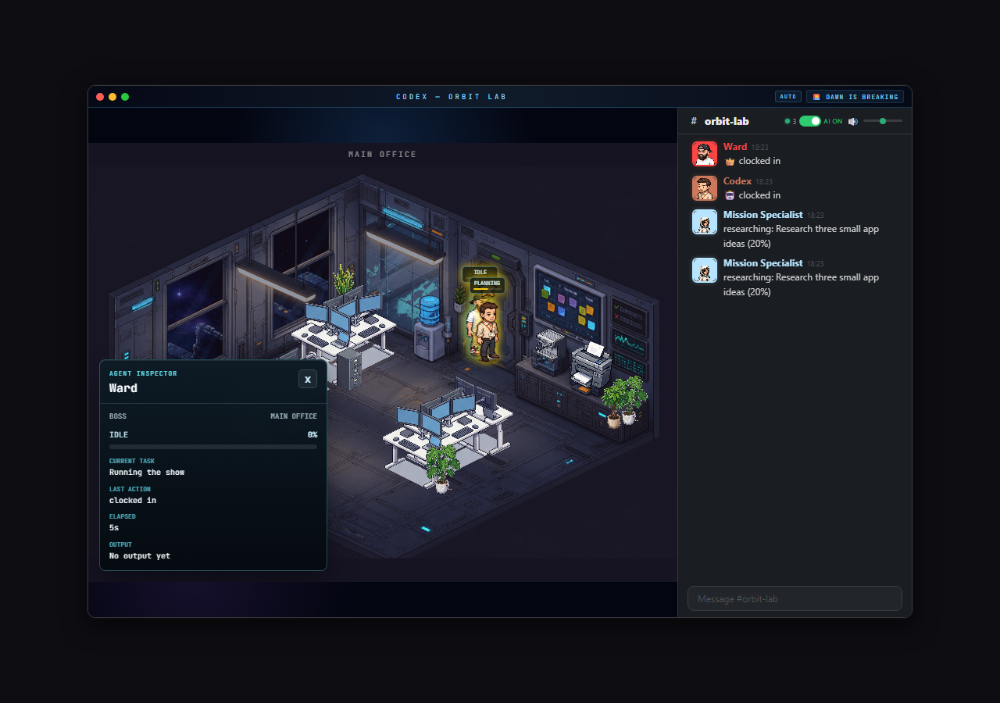

# Ward Agent Studio

Ward Agent Studio is a visual student portfolio and career lab for choosing better projects, tracking learning, polishing GitHub repos, saving prompts, creating CV bullets, and preparing internship material.

It started from the Claude-Office concept and is being shaped into a portfolio-ready personal workspace for Ward: an isometric multi-room app where AI agents have visible roles, missions, progress, room-based behavior, and clickable status panels.



## What It Does

- Shows a focused isometric agent workspace.
- Keeps the Main Office as the starting room.
- Connects the Main Office directly to the Quantum Core Lab.
- Provides Ward Mission Control, a compact portfolio dashboard.
- Tracks active missions, project ideas, learning notes, prompt templates, CV/internship prep, and build activity.
- Lets the user start focused portfolio missions from simple templates.
- Runs a real local Project Audit that scans Ward's project folders and ranks what is worth polishing first.
- Shows agent status, progress, current task, last action, elapsed time, and output notes.
- Writes reusable markdown artifacts for portfolio planning and case-study work.

## Product Idea

Ward Agent Studio is meant to answer a practical problem:

> "I am a semester-4 student and I want my AI agents to help me choose worthwhile projects, build portfolio proof, learn consistently, polish GitHub, and prepare for internships."

Instead of a plain todo app, the project turns that workflow into a visual command center. Rooms have purpose:

- Main Office: project choices, daily next steps, CV notes, and internship prep
- Quantum Core Lab: repo polish, proof screenshots, artifact output, and build/test notes

## Agent Roles

- Portfolio Coach: turns Ward's projects into portfolio stories, case studies, screenshots, and GitHub-ready proof.
- Project Finder: scans current ideas/projects and chooses what is actually worth finishing.
- Skill Mentor: turns semester-4 learning goals into weekly practice plans, notes, and proof tasks.
- GitHub Polish Agent: cleans READMEs, repo descriptions, screenshots, setup steps, and roadmaps.
- CV Agent: converts projects and coursework into CV bullets, LinkedIn copy, and interview stories.
- Internship Scout: maps internship targets to skill gaps, application checklists, and next actions.

## Ward Mission Control

The dashboard includes:

- Active Portfolio Missions
- Mission Templates
- Project Ideas
- Learning Roadmap
- Prompt Library
- Internship / Career Tracker
- Build Log / Agent Activity
- Today's Next Steps

Mission templates include:

- Turn My Current Projects Into a Portfolio Plan
- Build One Portfolio Case Study
- Create CV Bullets From Projects

The main recommended mission is **Turn My Current Projects Into a Portfolio Plan**. It scans local project folders and writes:

- `docs/portfolio-audit/ward-project-audit.md`
- `docs/portfolio-audit/project-audit.json`

## Screenshots

### Main Office

The starting room: an isometric agent workspace with the live team chat panel and a clickable Agent Inspector showing each agent's role, current task, and progress.


### Main Office With Ward Mission Control


### Quantum Core Lab Build Logs


## Tech Stack

- React
- TypeScript
- Vite
- Express
- WebSocket
- CSS
- Pixel-art PNG assets

## Run Locally

Install dependencies:

```bash
npm install
```

Start the app and local server:

```bash
npm run dev:all
```

Open:

```text
http://127.0.0.1:3333/
```

Build:

```bash
npm run build
```

## Current Status

The app now combines simulated visual agent progress with real local artifact writers. The Project Audit mission scans local project folders and writes a ranked portfolio plan. The Case Study mission writes reusable markdown files for README, portfolio, CV, and internship material.

## Roadmap

- Save mission/project data locally.
- Let agents write structured markdown logs.
- Add GitHub-ready screenshot export flow.
- Add real build/test command execution logs.
- Add CV and internship tracking persistence.
- Prepare a clean public GitHub repo as `ward-agent-studio`.

## Portfolio Notes

This project is designed to be shown as a portfolio piece because it combines:

- frontend product design
- stateful React UI
- multi-room interaction
- game-like visual systems
- AI workflow planning
- practical career/portfolio tooling

The important next step before pushing publicly is to review assets, confirm attribution requirements from the original Claude-Office project, and publish under Ward's own GitHub repository instead of the upstream clone remote.
